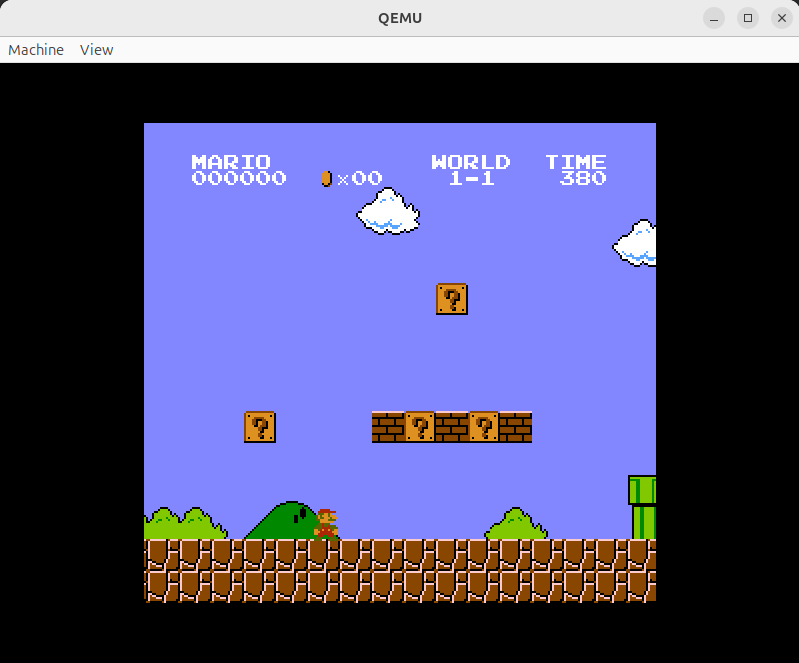
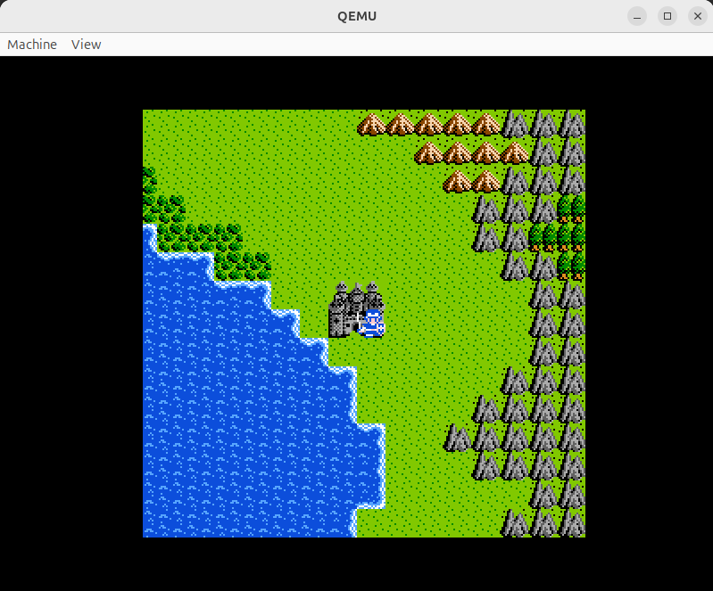
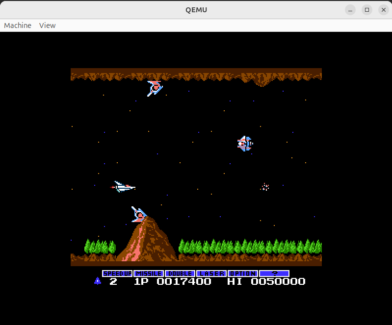
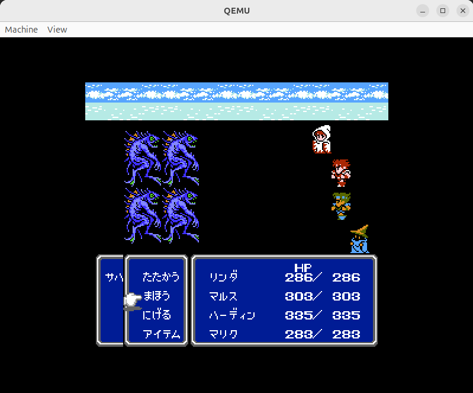

# Brightnes - A NES emulator running w/o OS!

A NES emulator running on x86_64 architecture without an operating system. This project also includes an original UEFI bootloader.

Brightnes can be seen as a kind of OS for running NES games, if you are tolerant of defining "OS" loosely.

## Why?

Just for fun. I think there are **so few** advantages against modern other NES emulators. Yet, I feel like this is an interesting project.

## NOTICE

Use ROMs dumped from your own cartridges, or homebrew ones. Do not use illegally-obtained ROMs.

## Supported games

The games listed below were tested. The emulator can properly handle games that use the same mapper.

If you don't know what is the mapper, please consult [NesDev Mapper](https://www.nesdev.org/wiki/Mapper). Strictly speaking, I tested Brightnes with Famicom cartridges (JP ver. of NES). So, potentially, some NES cartridges might not work as expected.

### Mapper 0 (NROM)

- Super Mario Bros.

    </img>

- Excite Bike
- Xevious
- Donkey Kong

### Mapper 2

- Dragon Quest II

    </img>

### Mapper 3

- Gradius

    </img>

### Mapper 4

- Final Fantasy III (My favorite, in particular)

    </img>

- さんまの名探偵 (Samma no Meitantei)

### Mapper 1 :construction:

Coming soon. Stay tuned.

## Dependencies

This software uses the following items:
- [Tamsyn font](http://www.fial.com/~scott/tamsyn-font/)
